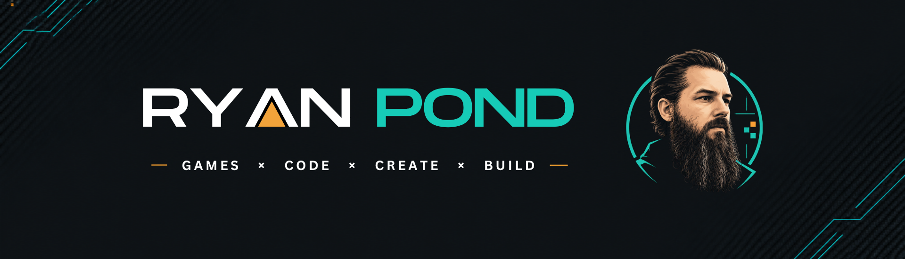

# Ryan Pond

I'm an indie game developer building small games, learning **Godot**, and documenting the process. I share what works, what breaks, and what I learn along the way.

## Currently Building

**DOOM DELIVERY** — a momentum-based bicycle courier game originally built for Godot Wild Jam.

## What I'm Into

Game development, programming, game jams, and small prototypes and technical experiments. Godot is my main tool for turning ideas into playable games.

## Find Me

[itch.io](https://nuexguy.itch.io/) · [YouTube](https://www.youtube.com/@ryanpond) · [X](https://x.com/RyanPondBuilds) · [GitHub](https://github.com/ryanpond)
